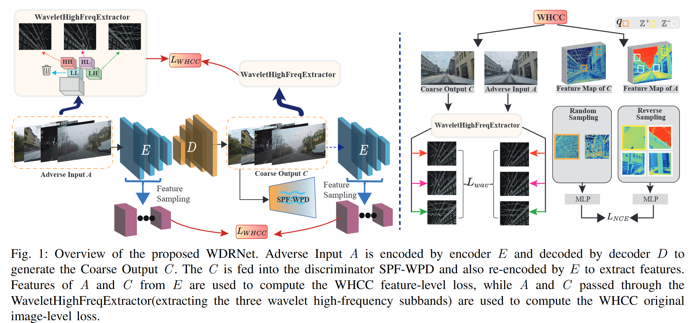
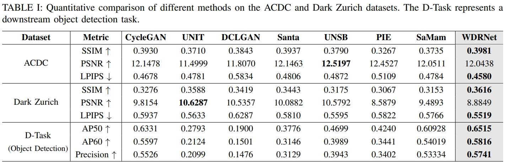
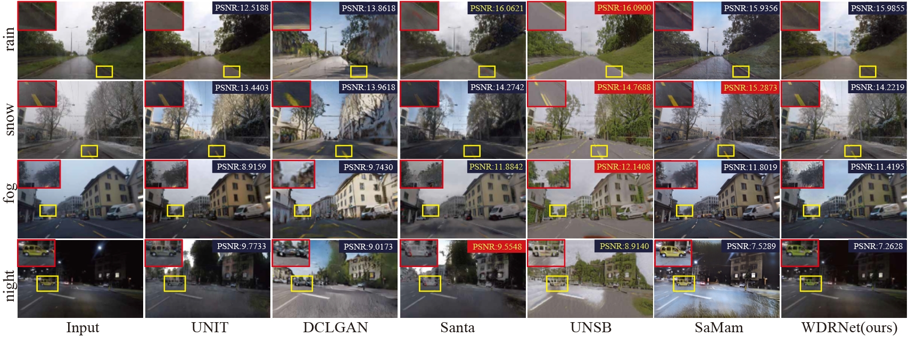
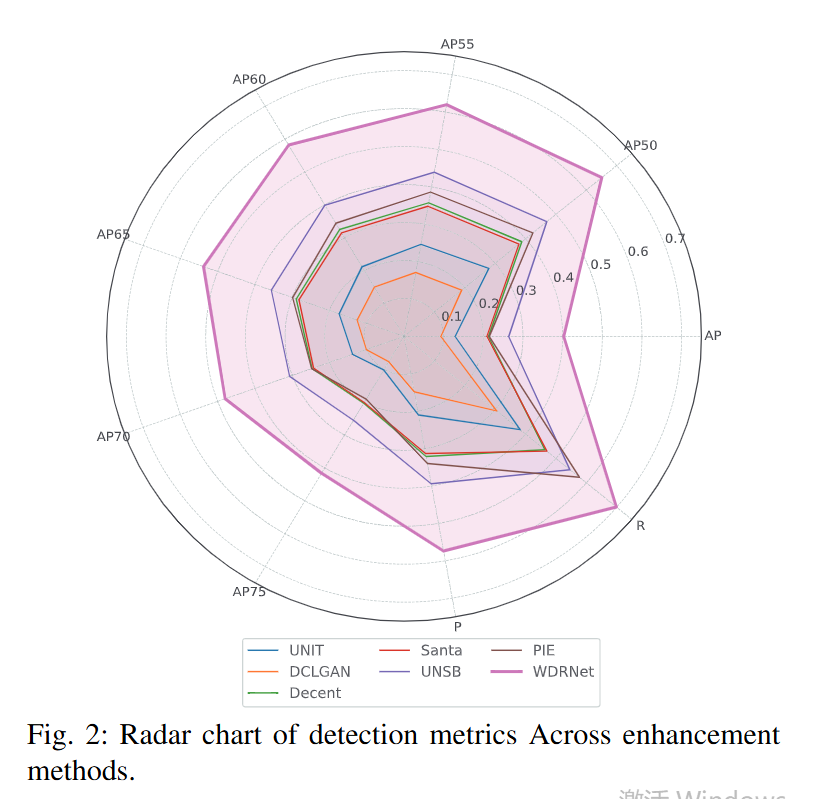
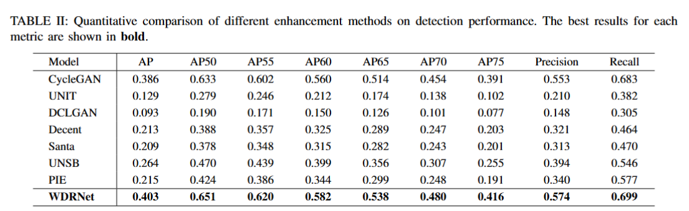
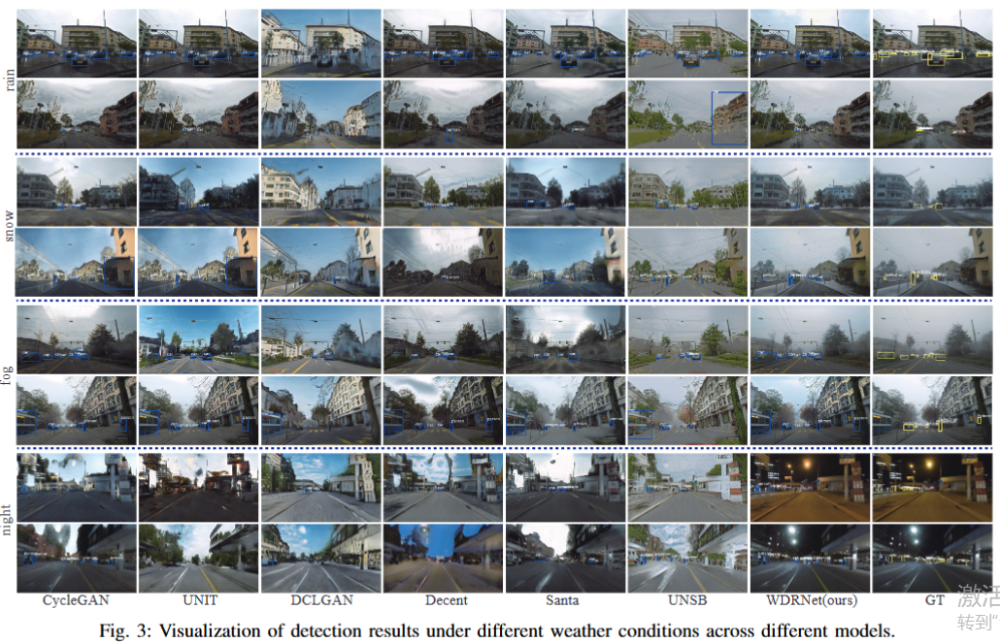

#  Beyond Weather Constraints : Unsupervisd All-weather Image Restoration via Adaptive Wavelet-Contrastive Learning
Adverse weather such as rain, fog, snow, and low light severely degrades visibility in traffic scenes. We propose **WDRNet (Wavelet Deweathering Restoration Network)**, an **unsupervised all-weather enhancement model** that integrates a **Spatial–Frequency Wavelet Pyramid Discriminator (SPF-WPD)** and a **Wavelet High-frequency Contrastive Consistency Loss (WHCC)**. WDRNet removes large-area weather degradations while preserving fine details—such as road edges and object boundaries—producing **clear, structurally consistent, and visually reliable results** without requiring paired data.

---
## 📰 News  

- **Mar 18, 2026**: Our paper is under submission to **SMC 2026** 📑  
- **Nov 8, 2025**: Codes are released!  🚀
- **Nov 8, 2025**: Homepage is released!💥
---

## 🏗️ Model Architecture  
<div align="center">
  
</div>

### ✨ Key Features  

- **Unsupervised All-Weather Enhancement**: WDRNet is specifically designed for real-world traffic scenes, balancing **low-frequency weather removal** with **high-frequency texture preservation**.

- **Spatial–Frequency Wavelet Pyramid Discriminator (SPF-WPD)**: This discriminator models large-area weather degradations across **multiple spatial and frequency scales**, improving robustness under diverse adverse conditions.

- **Wavelet High-frequency Contrastive Consistency Loss (WHCC)**: Combines **multi-level feature contrastive learning** with **wavelet high-frequency consistency** to effectively preserve fine details such as **road edges, vehicle boundaries, and building contours**.
---

## 📊 Experimental Results  
<div align="center">
  
</div>

<div align="center">
  
</div>

- **Quantitative Comparison**  
  - Achieves the best SSIM and lowest LPIPS on **ACDC** and **Dark Zurich**, showing strong structural fidelity and perceptual quality.  
  - Maintains competitive PSNR and delivers consistent improvements across diverse weather and lighting conditions.  

- **Qualitative Evaluation**  
  - Preserves key scene structures such as road markings, lane lines, and distant regions under rain, snow, and fog.  
  - Produces more realistic visuals, enhancing nighttime illumination while retaining vehicle and scene details.  
### 🎯 Downstream Task: Object Detection

<div align="center">
  
  
</div>
<div align="center">
  
</div>

- **Improved Detection Accuracy**  
  WDRNet preserves road textures and object boundaries more effectively than previous methods, resulting in stronger downstream perception. It achieves the highest performance across all detection metrics, with improvements of **+2.91% AP50**, **+3.96% AP60**, and **+3.40% Precision** over the best competing method.

- **Robustness Under Adverse Weather**  
  Competing approaches (e.g., UNIT, DCLGAN) often suppress semantic regions under heavy weather degradation, causing noticeable drops in detection accuracy. In contrast, WDRNet’s full-frequency modeling and high-frequency consistency better retain critical cues such as vehicle contours and lane structures, leading to more reliable detection outcomes.

---


## 🚀 Training & Testing (to be updated)

###  Dataset  
Supported datasets include:  
- [ACDC](https://acdc.vision.ee.ethz.ch/)  
- [Dark Zurich](https://www.trace.ethz.ch/publications/2019/GCMA_UIoU/?utm_source=chatgpt.com)

### Organize the dataset
The datasets should be organized as follows:
```bash
├── ACDC
│   ├── trainA  # Contains adverse weather images
│   └── trainB  # Contains normal weather images
```


###  Usage 
```bash
# Training
python train.py --dataroot ./datasets/weather --name AllWeather --mode WDRNet

# Testing
python test.py --dataroot ./datasets/weather --name  AllWeather --mode WDRNet --phase train

```
---

## 📚 Citation

If you find this work useful in your research, please cite:

```bibtex
@article{WDRNet2026,
  title={Beyond Weather Constraints : Unsupervisd All-weather Image Restoration via Adaptive Wavelet-Contrastive Learning},
  year={2026}
}

---
